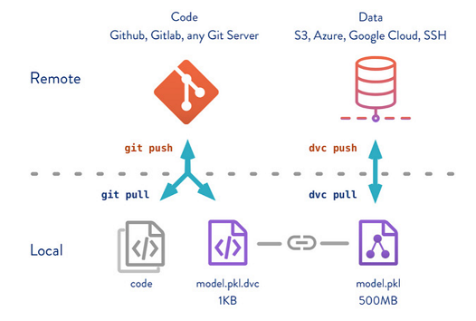

# Practica de despliegue de modelos de Machine Learning

## Introducción
En este repositorio se encuentra el código necesario para desplegar un modelo de Machine Learning. Se busca detallar el paso a paso para poder realizar el despliegue y conocer el flujo de MLOps.

Se analizan las técnicas empleadas con el fin de implementar y automatizar la integración continua (CI), la entrega continua (CD) y el entrenamiento continuo (CT) para sistemas de aprendizaje automático (AA).

Diseñar y entrenar un modelo de AA es solo una pequeña parte del desafío, lo verdaderamente complejo es su implementación, que comprende la configuración, automatización, recopilación y verificación de datos, pruebas y depuración, la administración de recursos, el análisis de modelos, la administración de metadatos y procesos, la infraestructura de entregas y la supervisión. Es por ello que comienza a aplicarse las prácticas de MLOps.

MLOps es una práctica de la ingeniería de AA, cuyo fin es unificar el desarrollo (Dev) y las operaciones (Ops) del sistema de AA. La práctica de MLOps implica abogar por la automatización y la supervisión en todos los pasos de la construcción del sistema de AA, incluida la integración, las pruebas, el lanzamiento, la implementación y la administración de la infraestructura.

## Arquitectura del proyecto


- Se codificará en Python y se usará la biblioteca scikit-learn para la generación de modelos
- Se utilizará GitHub como gestor de versiones del código y DVC como gestor de versiones del dataset y de los modelos
- Como servicio de alojamiento del modelo y dataset se utilizará Google drive
- Se utilizará GitHub Action para el proceso de integración continua y despliegue continuo (CI / CD)
- Por último, se utilizará FastAPI para la creación del API REST y Docker para el despliegue del servicio

Por medio de Github actions, se van a activar tres workflows diferentes:

- Testing: se va a encargar de ejecutar los test unitarios

- CI / CD: se va a encargar de la creación del docker y desplegar el servicio cada vez que hay una actualización del modelo.

- Reentrenamiento: va a utilizar Scikit learn para reentrenar un modelo de Machine Learning y generar nuevos modelos actualizados.

## Distribución de archivos

- **.dvc/ :** configuraciones de DVC
- .github/workflows/ : actions que se ejecutaran
- **api/ :** API para la realizacion de una prediccion
- **datset/ :** dataset traqueado
- **img :** imagenes para el readme
- **model/ :** modelo generado
- **notebooks/ :** notebooks donde se analizo el dataset y la generacion del modelo
- **src/ :** archivos usados para el CI-CD
- utilities/ : archivos con utilidades especificas

## Notebook
Se busca crear un modelo que pueda predecir el porcentaje de no supervivencia de un arbol dependiendo de diferentes factores

Se encuentran dos archivos:
-  [Data-analisis](notebook\data-analisis.ipynb): donde se analizaron las variables disponibles del dataset y se determino cuales son las verdaderamente relevamentes para el modelo.

-  [Model](notebook\model.ipynb): donde se analizaron diferentes metodos de entrenamiento y se realizo una busqueda de hiperparametros para determinar cual seria el mas conveniente. Ademas, se genero un primer modelo para realizar el primer despliegue.

## Implementacion de DVC

DVC se utiliza como gestor de versiones del dataset y de los modelos. Estos archivos suelen ser muy pesados, por lo que git no suele manejarlos adecuadamente. 

DVC permite subir estos archivos pesados a un servicio de alojamiento (storage), para este caso Google Drive, y genera un archivo de trackeo, el cual es el que se sube a github. 

El archivo de trackeo posee la ubicacion del archivo original y, ademas, lleva el control de versiones del mismo.



<sup>Para este caso, tenemos el archivo model.pkl el cual se sube a un storage. el mismo es trackeado mediante el archivo model.pkl.dvc y es este archivo el que se sube al git</sup>

Para la utilizacion del paquete ademas del:

    pip install dvc

hay que instalar las dependencias adicionales segun el storage a utilizar, para este caso:

    pip install dvc[gdrive]

Para usarla lo mejor es hacer un service accounts de Google. Siguiendo el tutorial de la documentacion de DVC se puede realizar sin problema:

[DVC user guide - Google Drive - Service accounts](https://dvc.org/doc/user-guide/data-management/remote-storage/google-drive#using-service-accounts)

<sub>*Nota: si bien puede usarse Google Drive sin la necesidad de realizar un service accounts, no es recomendable ya que, al momento de hacer el CI/CD, no se tendra acceso al dataset o al modelo*</sub>

Por ultimo para implementar el DVC, seguir la documentacion de DVC:

[DVC user guide - Google Drive](https://dvc.org/doc/user-guide/data-management/remote-storage/google-drive)

Es importante agregar al .gitignore los archivos que se van a trackear (dataset, modelo, etc) para evitar que se suban al git y solo se suban los archivos de trackeo

## Implementacion de pipeline para CI-CD

Se generaron 3 archivos dentro de la carpeta src, que son los encargados, al utilizar GitHub Action, del proceso de integración continua y despliegue continuo (CI / CD):

- prepare.py: el encargado de preparar el dataset. Toma el dataset crudo, excluye las columnas que no son necesarias, elimina cualquier fila que le falte algun dato y genera un nuevo archivo: data_Modif.csv. Este es el que se utilizara para la generacion del modelo
- train.py:  el encargado de general el modelo a partir del data_Modif.csv
- utils.py: metodos auxiliares, como ser, la configuracion del logging, el guardado del nuevo modelo y la generacion de un reporte

Para poder realizar la implementacion de los pipeline se genero el archivo dvc.yaml, el mismo contiene los pasos de ejecucion:

- El primer paso es el prepare:
    ```
    prepare:
    cmd: python src/prepare.py
    outs:
    - dataset/data_Modif.csv
    ```
Estamos diciendo que ejecute el archivo prepare.py y que la salida sera el data_Modif.csv

- Como segundo paso es el training:
    ```
    training:
    cmd: python src/train.py
    deps:
    - dataset/data_Modif.csv
    ```
Estamos diciendo que ejecute el archivo train.py y que como dependencia use el data_Modif.csv

El dvc.yaml se ejecuta con el comando:

    dvc repro -f

y generara, debido a los pasos indicados, un modelo actualizado, el mismo no se actualizara en el repositorio, sino que posteriormente es necesario realizar:

    dvc add model/model.pkl
    dvc push

Esto se hara cuando se realice la configuracion del GitHub Action


## Implementacion de api

pydantic es el que se encarga de la validacion de los datos y la creacion del objeto, las clase son heredadas de la clase BaseModel. si lo llegara a necesitar podria realizar validaciones propias